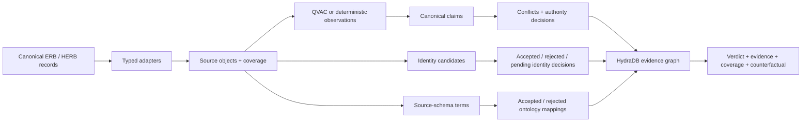

# Alethia

**Make conflict explain itself.**

Alethia is an enterprise evidence court built for **Hack Hydra Track 01: Enterprise Context and Ontology**. It turns contradictory records into a claim-level ontology in HydraDB, records why identities and source fields do—or do not—align, and returns one of four evidence-bound verdicts: `SUPPORTED`, `DISPUTED`, `NOT_FOUND`, or `UNKNOWN`.

The one-click demo uses real [Enterprise RAG Bench](https://github.com/onyx-dot-app/EnterpriseRAG-Bench) and [Salesforce HERB](https://huggingface.co/datasets/Salesforce/HERB) records. Enterprise text stays local: QVAC is called through its official Vercel AI SDK provider on loopback. QVAC proposes grounded observations; deterministic policy and HydraDB paths decide the result.

[Judge the product](#judge-path) · [See why HydraDB matters](#why-hydradb-is-essential) · [Reproduce locally](#reproduce-locally) · [Review measured results](#verified-results)

## At a glance

| | |
| --- | --- |
| **Track** | 01 — Enterprise Context and Ontology |
| **Problem** | Enterprise records disagree, identities collide, fields change meaning by source, and missing data is mistaken for proof of absence |
| **Product** | A judge-facing web application that returns a verdict, controlling answer, exact evidence, counterfactual, coverage state, and HydraDB path |
| **Graph core** | Canonical entities, immutable source objects, claims, observations, conflicts, authority policies, identity decisions, ontology mappings, and coverage slices |
| **Real data** | Enterprise RAG Bench and Salesforce HERB |
| **Stack** | Next.js, TypeScript, HydraDB OSS, QVAC, Vercel AI SDK, Docker Compose |
| **Failure policy** | Fail closed: no HydraDB proof means no verdict |

## Judge path

Once the [real local stack is populated](#reproduce-locally), open `http://localhost:3000/workspace` and run these cases in order:

1. **Resolve a conflict** — see two exact ERB quotes, the authority decision, the losing claim, and the native proof path.
2. **Refuse an unsupported winner** — confirm that equally applied evidence produces `DISPUTED`, not an invented answer.
3. **Admit incomplete coverage** — confirm that missing HERB coverage produces `UNKNOWN`.
4. **Traverse a product team** — inspect a real multi-hop product → membership → employee → claim → source traversal.
5. **Prove a fact is not found** — confirm that `NOT_FOUND` appears only when the relevant coverage slice is complete.

For every completed run, inspect the operation, consistency mode, relationship sequence, returned path, query ID, read epoch, bookmark, round trips, and client latency. Stop HydraDB and retry: the API must return HTTP 503 instead of substituting cached or in-memory evidence.

## Hackathon fit

| Judging criterion | What Alethia demonstrates | Where to inspect |
| --- | --- | --- |
| **Technical execution** | Deterministic ingestion-to-answer flow, typed adapters, stable IDs, explicit errors, replay checks, and eleven live behaviors | [`src/ingestion`](src/ingestion), [`src/cases`](src/cases), [`src/app/workspace`](src/app/workspace) |
| **HydraDB and graph-native use** | Native path algorithms over claims, observations, source objects, decisions, constraints, and coverage | [`src/hydra`](src/hydra), [ontology reference](docs/ontology.md) |
| **Product completeness** | Judge-facing landing page and evidence workspace with idle, loading, empty, error, disputed, unknown, not-found, and supported states | [`src/app`](src/app) |
| **Quality of results** | Development, frozen holdout, identity, alignment, safety, latency, resilience, and ablation results reported without hiding weak scores | [verified results](#verified-results) |
| **Originality** | Reconciliation is durable graph data: losing claims, rejected mappings, hard identity blockers, and coverage boundaries remain inspectable | [what makes it different](#what-makes-it-different) |

## What makes it different

Conventional RAG retrieves passages and asks a model to reconcile them inside a prompt. Alethia makes the reconciliation inspectable graph data:

- multiple extraction observations consolidate into one semantic claim without duplicating the answer;
- divergent payloads sharing one source-qualified native ID remain separate objects connected by explicit `VERSION_OF` lineage; unknown chronology is never guessed;
- losing claims remain queryable after conflict resolution;
- `owner` in Google Drive, HubSpot, and Fireflies maps through source context and domain/range constraints—not field-name similarity;
- names never auto-merge by fuzziness alone; verified identity conflicts are hard blockers;
- `NOT_FOUND` requires a completed coverage slice; missing coverage yields `UNKNOWN`;
- each verdict states what new evidence or decision would change it.

## Eleven live judge cases

| Case | Real-data proof | Result |
| --- | --- | --- |
| Resolve a conflict | ERB Jira proposal says 20%; applied Drive policy says 30% | `SUPPORTED` → 30%, with both exact quotes retained |
| Supersede stale guidance | ERB updated replay-risk guidance says 120 seconds; older guidance says 180 | `SUPPORTED` → 120 seconds, with the losing claim retained |
| Refuse an unsupported winner | ERB contains equally applied contradictory records with no authority distinction | `DISPUTED`; no controlling answer is invented |
| Disambiguate “owner” | ERB Drive and HubSpot source-schema observations | `FILE_OWNER` and `OPPORTUNITY_OWNER`, not generic `OWNS` |
| Reject an incompatible alignment | ERB source context conflicts with a generic domain/range mapping | Rejected mapping and constraint evidence remain queryable |
| Decide who this person is | HERB contains two David Taylor records with different employee IDs | Keep separate; the hard constraint blocks the fuzzy match |
| Accept a verified identity link | HERB records share an exact employee ID and agreeing name | Accepted link with resolution signals retained |
| Admit uncertainty | HERB has no completed `favorite_lunch` coverage | `UNKNOWN`, not a fabricated answer or false `NOT_FOUND` |
| Retrieve a canonical fact | HERB employee, role claim, and source evidence | `SUPPORTED` → Software Engineer |
| Traverse a product team | HERB product membership → employees → name claims → sources | `SUPPORTED` → grounded team roster |
| Prove covered absence | Complete HERB employee-location coverage contains Remote but no Lagos | `NOT_FOUND`, not `UNKNOWN` |

Every successful case is assembled from live HydraDB queries. API failures return HTTP 503; there is no evidence-file or in-memory success fallback.

## Architecture



HydraDB stores the ontology and performs the decisive traversals. Removing it loses claim-to-observation provenance, competing claims, policy decisions, rejected mappings, identity blockers, and coverage boundaries. See [the ontology reference](docs/ontology.md).

## Why HydraDB is essential

HydraDB is the system of record and the reasoning substrate—not a post-processing visualization. Ingestion writes the normalized ontology into HydraDB; the answer API then uses strong-consistency graph reads to assemble the verdict and its proof.

| HydraDB operation | Product responsibility |
| --- | --- |
| `algo.SPpaths` | Return one material entity → claim → observation → source proof path |
| `algo.SPpaths.sequence` | Enforce and expose a required relationship sequence for a judge case |
| `algo.MSpaths` | Return multiple bounded paths for multi-evidence or multi-hop answers |
| Strong-consistency read | Bind a verdict to a query ID, epoch, bookmark, latency, and round-trip count |
| Graph writes | Persist source objects, observations, claims, conflicts, decisions, mappings, identities, constraints, and coverage |

Without HydraDB, Alethia cannot prove which source observation produced a claim, retain contradictory and losing evidence, traverse rejected decisions, distinguish incomplete coverage from covered absence, or return a graph-native audit trail. The shipped API therefore fails closed when HydraDB is unavailable; it has no evidence-file or in-memory success fallback.

## Reproduce locally

### Requirements

- Node.js 20 or newer
- npm
- Docker with Compose
- Python 3 for canonical ERB acquisition
- enough unified/system memory for the local 27B model and its context cache
- a QVAC-compatible GPU backend (the checked-in profile uses Metal on Apple Silicon)
- enough free disk space for the pinned GGUF and runtime cache
- local checkouts or acquired slices of HERB and ERB outside this repository

Install dependencies and start HydraDB:

```bash
npm ci
cp .env.example .env.local
npm run hydra:up
```

Fetch the pinned [Qwen3.8-27B](https://huggingface.co/Qwen/Qwen3.8-27B) `UD-Q4_K_XL` GGUF from [Unsloth](https://huggingface.co/unsloth/Qwen3.8-27B-GGUF). The fetch command resumes partial downloads and verifies the expected 17,559,178,144-byte file against SHA-256 `3f227079003add2511437e5b1e94812e363385225bf6a9b47b0054a72bc8b01e` before QVAC can load it.

Start QVAC in a normal interactive macOS shell. The server binds to `127.0.0.1:11436`, loads the verified local GGUF through QVAC's explicit `src` support, and exposes the stable `alethia-extractor` alias through `@qvac/ai-sdk-provider` and AI SDK 7. Thinking and tools are disabled because QVAC proposes quote-grounded observations rather than making adjudication decisions.

```bash
npm run qvac:doctor
npm run qvac:model:fetch
npm run qvac:serve
```

Check QVAC's observed telemetry rather than assuming a GPU request was honored. On the verified M3 Pro run, the checked-in `ctx_size: 16384` profile used `backend=gpu`, the native runtime reported 66/66 model layers offloaded to Metal, and all three probes were accepted: two canonical ERB documents plus an exact WCAG quote grounded near the end of a 37,458-character canonical HERB slice. The verifier also checks the 17.56 GB model checksum before and after inference. The explicit `main-gpu: integrated` selector is intentionally absent: on unified-memory Apple Silicon it caused this QVAC build to select CPU, while `device: gpu` plus `gpu_layers: 99` selected Metal. Restart QVAC after profile changes and verify the loaded backend before relying on it. QVAC's official [macOS build requirements](https://github.com/tetherto/qvac/blob/main/packages/llm-llamacpp/build.md) list Xcode Command Line Tools and Apple Clang 15 or newer.

Clone the research datasets beside the project (not inside this Git repository), then set explicit local paths. HERB is research-only and CC BY-NC 4.0; review its dataset card before use.

```bash
git clone https://github.com/onyx-dot-app/EnterpriseRAG-Bench ../EnterpriseRAG-Bench
git clone https://github.com/SalesforceAIResearch/HERB ../HERB

export HERB_DIR="$(cd ../HERB && pwd)"
export ERB_QUESTIONS="$(cd ../EnterpriseRAG-Bench && pwd)/questions.jsonl"
export ERB_CONFLICTS_JSONL="$(pwd)/.local/evidence/erb-conflicts.jsonl"
export ERB_CONFLICTS_MANIFEST="$(pwd)/.local/evidence/erb-conflicts.manifest.json"
export ERB_ALIGNMENT_JSONL="$(pwd)/.local/evidence/erb-alignment.jsonl"
export ERB_ALIGNMENT_MANIFEST="$(pwd)/.local/evidence/erb-alignment.manifest.json"
export EVIDENCE_DIR="$(pwd)/.local/evidence/results"
mkdir -p "$EVIDENCE_DIR"
```

Acquire the bounded canonical ERB conflict slice from Hugging Face. Evaluation labels select records during acquisition but are not emitted into runtime JSONL.

```bash
python3 -m venv .local/data-venv
.local/data-venv/bin/pip install -r requirements-data.txt
.local/data-venv/bin/python scripts/fetch_erb_evidence.py \
  --selection conflicts \
  --questions "$ERB_QUESTIONS" \
  --output "$ERB_CONFLICTS_JSONL" \
  --manifest "$ERB_CONFLICTS_MANIFEST"
```

Acquire the alignment-discovery slice before running source-aware alignment:

```bash
.local/data-venv/bin/python scripts/fetch_erb_evidence.py \
  --selection alignment-discovery \
  --questions "$ERB_QUESTIONS" \
  --output "$ERB_ALIGNMENT_JSONL" \
  --manifest "$ERB_ALIGNMENT_MANIFEST"
```

Populate the verified graph lanes:

```bash
npm run hydra:smoke -- --input "$HERB_DIR" --evidence "$EVIDENCE_DIR/herb-structural.json"
npm run extract:erb-conflicts -- \
  --documents "$ERB_CONFLICTS_JSONL" \
  --manifest evaluation/erb-conflicts.runtime.json \
  --output "$EVIDENCE_DIR/erb-conflicts.json" \
  --limit 20
npm run adjudicate:erb-conflict -- \
  --extractions "$EVIDENCE_DIR/erb-conflicts.json" \
  --output "$EVIDENCE_DIR/qst_0411.json"
npm run freeze:erb-conflicts -- \
  --manifest evaluation/erb-conflicts.runtime.json \
  --extractions "$EVIDENCE_DIR/erb-conflicts.json" \
  --output "$EVIDENCE_DIR/erb-conflicts-frozen.json"
npm run evaluate:erb-conflicts -- \
  --runtime "$EVIDENCE_DIR/erb-conflicts-frozen.json" \
  --labels "$ERB_QUESTIONS" \
  --output "$EVIDENCE_DIR/erb-conflicts-score.json" \
  --answers "$EVIDENCE_DIR/erb-conflicts-answers.jsonl"
npm run audit:herb-identities -- --input "$HERB_DIR" --output "$EVIDENCE_DIR/herb-identities.json"
npm run audit:erb-versions -- \
  --input "$ERB_CONFLICTS_JSONL" \
  --manifest "$ERB_CONFLICTS_MANIFEST" \
  --output "$EVIDENCE_DIR/erb-versions.json"
```

The source-aware alignment command additionally requires an `alignment-discovery` acquisition manifest:

```bash
npm run discover:erb-alignment -- \
  --input "$ERB_ALIGNMENT_JSONL" \
  --manifest "$ERB_ALIGNMENT_MANIFEST" \
  --output "$EVIDENCE_DIR/erb-alignment.json"
```

Run the remaining reproducibility gates with parent-workspace evidence paths of your choice:

```bash
npm run qvac:verify-profile -- --documents "$ERB_CONFLICTS_JSONL" \
  --boundary-source "$HERB_DIR/data/products/ActionGenie.json" \
  --server-log "$EVIDENCE_DIR/qvac-server.log" \
  --native-log "$EVIDENCE_DIR/qvac-native.log" \
  --config qvac.config.json --model .local/models/Qwen3.8-27B-UD-Q4_K_XL.gguf \
  --output "$EVIDENCE_DIR/qvac-profile.json"
npm run verify:resilience -- \
  --herb-input "$HERB_DIR/data/products/ActionGenie.json" \
  --output "$EVIDENCE_DIR/resilience.json"
npm run measure:performance -- \
  --ledger "$EVIDENCE_DIR/ingestion-ledger.json" --trials 3 \
  --output "$EVIDENCE_DIR/performance.json"
```

Start the app and open [http://localhost:3000](http://localhost:3000):

```bash
npm run dev
```

## Repository map

| Path | Responsibility |
| --- | --- |
| [`src/ingestion`](src/ingestion) | Typed ERB and HERB adapters, normalization, and ingestion ledgers |
| [`src/claims`](src/claims) | Grounded observations and semantic claim consolidation |
| [`src/resolution`](src/resolution) | Identity candidates, signals, hard blockers, and resolution decisions |
| [`src/alignment`](src/alignment) | Source-schema observations, canonical terms, and mapping decisions |
| [`src/hydra`](src/hydra) | HydraDB graph mapping, writes, strong reads, and native path queries |
| [`src/cases`](src/cases) | Eleven registered judge behaviors and answer assembly |
| [`src/app`](src/app) | Alethia landing page, evidence workspace, and API routes |
| [`evaluation`](evaluation) | Runtime manifests and frozen evaluation definitions—not downloaded corpora |
| [`scripts`](scripts) | Acquisition, ingestion, evaluation, resilience, and verification commands |

## Configuration reference

| Variable | Default | Purpose |
| --- | --- | --- |
| `HYDRA_HTTP_URL` | `http://127.0.0.1:8443` | HydraDB HTTP endpoint |
| `HYDRA_TOKEN` | local development token | Bearer token; change before non-loopback use |
| `HYDRA_GRAPH_ID` | `default` | Graph identifier |
| `HYDRA_NAMESPACE` | `default` | Graph namespace |
| `HYDRA_CELL_ID` | `cell-0` | HydraDB cell |
| `QVAC_BASE_URL` | `http://127.0.0.1:11436/v1` | Local OpenAI-compatible QVAC endpoint |
| `QVAC_MODEL` | `alethia-extractor` | QVAC alias backed by the verified local Qwen3.8 27B GGUF |
| `QVAC_REQUEST_TIMEOUT_MS` | `120000` | Per-request timeout; bounded from 1,000 through 1,800,000 ms for long-context verification |

HydraDB is pinned by image digest in `docker-compose.yml`. Compose binds HydraDB ports to loopback only.

## Verified results

Fresh local evidence from August 20, 2026:

| Lane | Result |
| --- | ---: |
| Live judge behavior matrix | 11 attempted / 11 completed; `SUPPORTED`, `DISPUTED`, `UNKNOWN`, and `NOT_FOUND` all exercised through HydraDB |
| Browser production verification | 11/11 UI runs returned verdicts with 11 unique Hydra query IDs; desktop and 390 px mobile layouts verified |
| Promoted ERB conflict graphs | 19/19 written to real HydraDB; 15 resolved and 4 deliberately unresolved |
| ERB labeled development lane | 19 promoted conflict cases retained as iteratively engineered development evidence, never presented as an unseen result |
| Frozen unseen ERB holdout | 5/5 attempted; answer correctness/completeness and verdict accuracy 0.20; evidence precision 1.00, recall 0.10; coverage accuracy 1.00 |
| Audited source-aware mappings | 12 balanced labels: 6 accepted + 6 rejected; accuracy 1.00 on this audited slice, including same-surface/different-meaning and different-surface/equivalent-meaning strata |
| HERB identity candidates | 1,645 same-name pairs |
| Hard negative identity pairs blocked | 1,627 |
| Audited HERB identity resolution | 24 balanced pairs (12 positive / 12 negative); pairwise and B-cubed F1 1.00 on this audited slice; 0 false merges/splits |
| Representative ingestion ledger | 773/773 records accepted across 10 source-system labels; 752 distinct native objects |
| Representative Hydra graph | 12,615 nodes / 23,147 edges; deterministic replay preserved the exact fingerprint |
| Hydra native single-path leverage | 1 native round trip versus 4 bounded client round trips; 3 round trips avoided |
| Hydra native multi-path leverage | 2/2 paths returned by `algo.MSpaths` in 1 round trip |
| Policy/graph ablations | 5/5 produced the predicted material degradation |
| Resilience | 8/8 probes passed; repeated writes stable; 20 unique concurrent reads; 11/11 replay without QVAC; Hydra/QVAC outages failed closed |
| Hydra restart recovery | Pinned container restarted; persistent graph returned a strong-consistency native path in one round trip |
| Local graph latency (M3 Pro) | 33 new-connection samples: 14.348 ms median / 253.733 ms p95; 33 reused-connection samples: 15.430 ms median / 262.887 ms p95 |
| QVAC Metal profile | 3/3 accepted; 16,384 context; GPU observed; 66/66 model layers offloaded; 37,458-character boundary source grounded |
| Test suite | 355 passed / 2 skipped with a 15-second real-corpus timeout; live Hydra integration is reported separately |

The labeled conflict lane is development data after iterative engineering, not an unseen result. The separately frozen five-case holdout is intentionally reported even though it is weak; its `0.20` correctness is evidence about current generalization limits, not a score to hide. The later long-context profile proof demonstrates that the configured Metal runtime can ground a near-boundary fact; it does not retroactively rescore or replace the frozen holdout.

Performance figures are local Apple M3 Pro measurements over the representative graph. “New connection” means a newly constructed `HydraRepository`; it does not claim a cold operating-system or HydraDB page cache. No universal latency ratio is claimed.

Run the focused live evaluation:

```bash
npm run evaluate:first-prize -- \
  --herb-input "$HERB_DIR" \
  --output "$EVIDENCE_DIR/first-prize.json"
```

## How to verify the build

```bash
npx vitest run --testTimeout 15000
HYDRA_INTEGRATION=1 npm test -- src/hydra/hydra.integration.test.ts
npm run typecheck
npm run lint
npm run build
npm audit
git diff --check
```

## Data handling and attribution

Corpora, benchmark labels, local model files, saved evidence, and screenshots are deliberately excluded from this public repository.

- Enterprise RAG Bench is MIT-licensed.
- Salesforce HERB is CC BY-NC 4.0 and its dataset card states research-use limitations. Alethia does not imply unrestricted commercial use.
- HydraDB and QVAC retain their own licenses and terms.

See [ATTRIBUTION.md](ATTRIBUTION.md) for dependency and dataset links.

## License

Alethia is licensed under the [MIT License](LICENSE).
