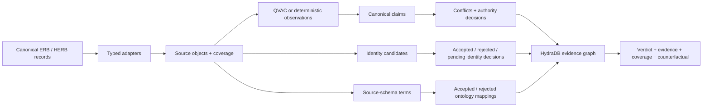

# SourceTruce

SourceTruce is an enterprise evidence court for Hack Hydra Track 01. It turns contradictory records into a claim-level ontology in HydraDB, records why identities and source fields do—or do not—align, and issues one of four verdicts: `SUPPORTED`, `DISPUTED`, `NOT_FOUND`, or `UNKNOWN`.

The one-click demo uses real [Enterprise RAG Bench](https://github.com/onyx-dot-app/EnterpriseRAG-Bench) and [Salesforce HERB](https://huggingface.co/datasets/Salesforce/HERB) records. Enterprise text stays local: QVAC is called through its official Vercel AI SDK provider on loopback. QVAC proposes grounded observations; deterministic policy and HydraDB paths decide the result.

## What makes it different

Conventional RAG retrieves passages and asks a model to reconcile them inside a prompt. SourceTruce makes the reconciliation inspectable graph data:

- multiple extraction observations consolidate into one semantic claim without duplicating the answer;
- divergent payloads sharing one source-qualified native ID remain separate objects connected by explicit `VERSION_OF` lineage; unknown chronology is never guessed;
- losing claims remain queryable after conflict resolution;
- `owner` in Google Drive, HubSpot, and Fireflies maps through source context and domain/range constraints—not field-name similarity;
- names never auto-merge by fuzziness alone; verified identity conflicts are hard blockers;
- `NOT_FOUND` requires a completed coverage slice; missing coverage yields `UNKNOWN`;
- each verdict states what new evidence or decision would change it.

## Four live judge cases

| Case | Real-data proof | Result |
| --- | --- | --- |
| Resolve a conflict | ERB Jira proposal says 20%; applied Drive policy says 30% | `SUPPORTED` → 30%, with both exact quotes retained |
| Disambiguate “owner” | ERB Drive and HubSpot source-schema observations | `FILE_OWNER` and `OPPORTUNITY_OWNER`, not generic `OWNS` |
| Decide who this person is | HERB contains two David Taylor records with different employee IDs | Keep separate; the hard constraint blocks the fuzzy match |
| Admit uncertainty | HERB has no completed `favorite_lunch` coverage | `UNKNOWN`, not a fabricated answer or false `NOT_FOUND` |

Every successful case is assembled from live HydraDB queries. API failures return HTTP 503; there is no evidence-file or in-memory success fallback.

## Architecture



HydraDB stores the ontology and performs the decisive traversals. Removing it loses claim-to-observation provenance, competing claims, policy decisions, rejected mappings, identity blockers, and coverage boundaries. See [the ontology reference](docs/ontology.md).

## How to run the evidence court

### Requirements

- Node.js 20 or newer
- npm
- Docker with Compose
- Python 3 for canonical ERB acquisition
- 36 GB unified/system memory recommended for the local 27B model
- a QVAC-compatible GPU backend (the checked-in profile uses Metal on Apple Silicon)
- 20 GB free disk space for the pinned Qwen3.8 GGUF and runtime cache
- local checkouts or acquired slices of HERB and ERB outside this repository

Install dependencies and start HydraDB:

```bash
npm install
cp .env.example .env.local
npm run hydra:up
```

Fetch the pinned [Qwen3.8-27B](https://huggingface.co/Qwen/Qwen3.8-27B) `UD-Q4_K_XL` GGUF from [Unsloth](https://huggingface.co/unsloth/Qwen3.8-27B-GGUF). The fetch command resumes partial downloads and verifies the expected 17,559,178,144-byte file against SHA-256 `3f227079003add2511437e5b1e94812e363385225bf6a9b47b0054a72bc8b01e` before QVAC can load it.

Start QVAC in a normal macOS Terminal session, not in Codex's terminal or from any process launched by Codex. The server binds to `127.0.0.1:11436`, loads the verified local GGUF through QVAC's explicit `src` support, and exposes the stable `sourcetruce-extractor` alias through `@qvac/ai-sdk-provider` and AI SDK 7. Thinking and tools are disabled because QVAC proposes quote-grounded observations rather than making adjudication decisions.

```bash
npm run qvac:doctor
npm run qvac:model:fetch
npm run qvac:serve
```

Check QVAC's per-request `backend=` telemetry rather than assuming that a GPU request was honored. A one-layer diagnostic launched by Codex returned `metal: false`, no enumerated GPUs, and `backend=cpu`; this is not evidence that QVAC's Apple Silicon prebuild is broken. Codex's macOS Seatbelt sandbox can block the IOKit access Metal needs for device enumeration, including in `danger-full-access` mode ([Codex #17644](https://github.com/openai/codex/issues/17644), [Codex #9007](https://github.com/openai/codex/issues/9007)). Stop any Codex-launched QVAC server, launch `npm run qvac:serve` manually from Terminal, and confirm that request telemetry reports `backend=gpu`. If needed, diagnose first with `device: "gpu"`, `main-gpu: "integrated"`, `gpu_layers: 1`, `ctx_size: 512`, and `verbosity: 3`; then restore the checked-in `gpu_layers: 99` and `ctx_size: 4096` profile for the full-offload test. QVAC's official [macOS build requirements](https://github.com/tetherto/qvac/blob/main/packages/llm-llamacpp/build.md) list Xcode Command Line Tools and Apple Clang 15 or newer; full Xcode is not a prerequisite.

Clone the research datasets beside the project (not inside this Git repository), then set explicit local paths. HERB is research-only and CC BY-NC 4.0; review its dataset card before use.

```bash
git clone https://github.com/onyx-dot-app/EnterpriseRAG-Bench ../EnterpriseRAG-Bench
git clone https://github.com/SalesforceAIResearch/HERB ../HERB

export HERB_DIR="$(cd ../HERB && pwd)"
export ERB_QUESTIONS="$(cd ../EnterpriseRAG-Bench && pwd)/questions.jsonl"
export ERB_CONFLICTS_JSONL="$(pwd)/.local/evidence/erb-conflicts.jsonl"
export ERB_CONFLICTS_MANIFEST="$(pwd)/.local/evidence/erb-conflicts.manifest.json"
export ERB_ALIGNMENT_JSONL="$(pwd)/.local/evidence/erb-alignment.jsonl"
export ERB_ALIGNMENT_MANIFEST="$(pwd)/.local/evidence/erb-alignment.manifest.json"
export EVIDENCE_DIR="$(pwd)/.local/evidence/results"
mkdir -p "$EVIDENCE_DIR"
```

Acquire the bounded canonical ERB conflict slice from Hugging Face. Evaluation labels select records during acquisition but are not emitted into runtime JSONL.

```bash
python3 -m venv .local/data-venv
.local/data-venv/bin/pip install -r requirements-data.txt
.local/data-venv/bin/python scripts/fetch_erb_evidence.py \
  --selection conflicts \
  --questions "$ERB_QUESTIONS" \
  --output "$ERB_CONFLICTS_JSONL" \
  --manifest "$ERB_CONFLICTS_MANIFEST"
```

Acquire the alignment-discovery slice before running source-aware alignment:

```bash
.local/data-venv/bin/python scripts/fetch_erb_evidence.py \
  --selection alignment-discovery \
  --questions "$ERB_QUESTIONS" \
  --output "$ERB_ALIGNMENT_JSONL" \
  --manifest "$ERB_ALIGNMENT_MANIFEST"
```

Populate the verified graph lanes:

```bash
npm run hydra:smoke -- --input "$HERB_DIR" --evidence "$EVIDENCE_DIR/herb-structural.json"
npm run extract:erb-conflicts -- \
  --documents "$ERB_CONFLICTS_JSONL" \
  --questions "$ERB_QUESTIONS" \
  --output "$EVIDENCE_DIR/erb-conflicts.json" \
  --limit 20
npm run adjudicate:erb-conflict -- \
  --extractions "$EVIDENCE_DIR/erb-conflicts.json" \
  --output "$EVIDENCE_DIR/qst_0411.json"
npm run audit:herb-identities -- --input "$HERB_DIR" --output "$EVIDENCE_DIR/herb-identities.json"
npm run audit:erb-versions -- \
  --input "$ERB_CONFLICTS_JSONL" \
  --manifest "$ERB_CONFLICTS_MANIFEST" \
  --output "$EVIDENCE_DIR/erb-versions.json"
```

The source-aware alignment command additionally requires an `alignment-discovery` acquisition manifest:

```bash
npm run discover:erb-alignment -- \
  --input "$ERB_ALIGNMENT_JSONL" \
  --manifest "$ERB_ALIGNMENT_MANIFEST" \
  --output "$EVIDENCE_DIR/erb-alignment.json"
```

Start the app and open [http://localhost:3000](http://localhost:3000):

```bash
npm run dev
```

## Configuration reference

| Variable | Default | Purpose |
| --- | --- | --- |
| `HYDRA_HTTP_URL` | `http://127.0.0.1:8443` | HydraDB HTTP endpoint |
| `HYDRA_TOKEN` | local development token | Bearer token; change before non-loopback use |
| `HYDRA_GRAPH_ID` | `default` | Graph identifier |
| `HYDRA_NAMESPACE` | `default` | Graph namespace |
| `HYDRA_CELL_ID` | `cell-0` | HydraDB cell |
| `QVAC_BASE_URL` | `http://127.0.0.1:11436/v1` | Local OpenAI-compatible QVAC endpoint |
| `QVAC_MODEL` | `sourcetruce-extractor` | QVAC alias backed by the verified local Qwen3.8 27B GGUF |

HydraDB OSS 0.1.0 is pinned by image digest in `docker-compose.yml`. Compose binds HydraDB ports to loopback only.

## Verified results

Fresh local evidence from August 19, 2026:

| Lane | Result |
| --- | ---: |
| Live judge cases | 5 attempted / 5 completed / 100% expected outcome |
| Qwen3.8 ERB conflict extraction | 20 questions attempted; 39/40 observations accepted; 1 rejected |
| Promoted ERB conflict graphs | 19 (6 resolved by lifecycle policy, 13 left `DISPUTED`) |
| Divergent ERB source-version groups | 1 group / 2 payload versions / 1 `VERSION_OF` edge |
| Source-aware mappings | 5 accepted + 5 rejected alternatives |
| HERB identity candidates | 1,645 same-name pairs |
| Hard negative identity pairs blocked | 1,627 |
| SourceTruce false merges on known hard negatives | 0 |
| Full HERB graph | 12,378 nodes / 22,906 edges |
| Unit tests | 146 passed + 2 integration-only tests skipped in the ordinary run |
| Explicit Hydra integration | 2/2 passed |

The 20-question conflict run is reported as an attempt, not a benchmark score. Qwen3.8 produced 39 strictly grounded observations; one `qst_0412` response was rejected because it hit the output bound with invalid JSON. Nineteen contradiction pairs persist in HydraDB. Six resolve only where lifecycle evidence supports both sides; thirteen, including handshake TTL `qst_0421`, stay `DISPUTED` when the policy cannot compare both claims safely.

Run the focused live evaluation:

```bash
npm run evaluate:first-prize -- \
  --herb-input "$HERB_DIR" \
  --output "$EVIDENCE_DIR/first-prize.json"
```

## How to verify the build

```bash
npm test
HYDRA_INTEGRATION=1 npm test -- src/hydra/hydra.integration.test.ts
npm run typecheck
npm run lint
npm run build
npm audit
git diff --check
```

## Data handling and attribution

Corpora, benchmark labels, local model files, saved evidence, and screenshots are deliberately excluded from this public repository.

- Enterprise RAG Bench is MIT-licensed.
- Salesforce HERB is CC BY-NC 4.0 and its dataset card states research-use limitations. SourceTruce does not imply unrestricted commercial use.
- HydraDB and QVAC retain their own licenses and terms.

See [ATTRIBUTION.md](ATTRIBUTION.md) for dependency and dataset links.

## License

SourceTruce is licensed under the [MIT License](LICENSE).
