# SourceTruce

SourceTruce is an enterprise evidence court built for Hack Hydra Track 01. It converts heterogeneous records into a claim-level ontology in HydraDB, resolves duplicate identities through inspectable decisions, and returns one of four verdicts: `SUPPORTED`, `DISPUTED`, `NOT_FOUND`, or `UNKNOWN`.

The distinction between the last two is the product: SourceTruce only says `NOT_FOUND` when a recorded coverage slice proves that the relevant source, object type, predicate family, and content scope were examined. Otherwise it abstains with `UNKNOWN` and names the missing coverage.

No LLM is required for the current structural pipeline. Ingestion, identity resolution, claim extraction, coverage checks, HydraDB persistence, and verdict selection are deterministic. A future QVAC adapter belongs only at the unstructured extraction boundary; it cannot bypass provenance, coverage, or conflict policy.

## What works now

- real HERB ingestion: 698 records across employees, customers, team structures, and products;
- deterministic, reversible entity resolution with accepted and rejected merge certificates;
- 5,130 claim-level facts with source-object provenance and zero extraction gaps on the structural slice;
- a real, idempotent write/read round trip against HydraDB OSS 0.1.0;
- graph-native evidence traversal from canonical entity to claim to source object;
- a live four-node traversal from ActionGenie to 66 canonical team members and their source records;
- coverage-qualified negative answers and explicit abstention;
- a local judge-facing web app with loading, empty, error, evidence, and knowledge-boundary states;
- repeatable metrics for verdicts, evidence retrieval, identity resolution, latency, and ablations.

## Architecture

```mermaid
flowchart LR
  A["HERB source records"] --> B["Typed source adapter"]
  B --> C["Canonical source objects"]
  C --> D["Entity resolver"]
  D --> E["Merge decisions + canonical entities"]
  E --> F["Deterministic claim extractor"]
  F --> G["Claims + evidence + coverage slices"]
  G --> H["HydraDB ontology"]
  H --> I["Graph evidence traversal"]
  I --> J["Coverage and conflict gates"]
  J --> K["Decision dossier"]
```



HydraDB stores `Entity`, `SourceObject`, `Claim`, `CoverageSlice`, `IngestionRun`, and `ResolutionDecision` nodes. Relationships include `ASSERTS`, `SUPPORTED_BY`, `RESOLVES_TO`, `COVERS`, `OBSERVED_IN`, `CONSIDERS`, `MEMBER_OF`, `MANAGES`, `HAS_TEAM_MEMBER`, and `SERVES_CUSTOMER`. See [docs/ontology.md](docs/ontology.md) for the graph contract.

### Why HydraDB is core

The answer path is a graph traversal, not a vector-search citation pasted onto generated prose:

```text
(Entity)-[:ASSERTS]->(Claim)-[:SUPPORTED_BY]->(SourceObject)
```

Coverage and resolution decisions are also graph objects. Removing HydraDB loses the auditable relationship between a canonical identity, its claim, its original record, the ingestion run that examined it, and the decision that merged it. The API intentionally returns HTTP 503 when HydraDB is unavailable; there is no in-memory success fallback.

## Reproduce it

Requirements:

- Node.js 20+
- npm
- Docker with Compose
- the Salesforce HERB dataset checked out outside this repository

```bash
git clone https://huggingface.co/datasets/Salesforce/HERB ../resources/HERB
npm install
npm run hydra:up
npm run hydra:smoke -- \
  --input ../resources/HERB \
  --evidence ../submission/evidence/hydradb-roundtrip/herb-structural.json
npm run dev
```

Open [http://localhost:3000](http://localhost:3000). The interface starts with a verified HERB entity and role query so the first click produces a real evidence path.

HydraDB is pinned by digest in `docker-compose.yml`:

```text
ghcr.io/hydra-db/hydradb@sha256:db78309a233be54662db29744047e985a39b51c45a270d1a1f47c31a62cdb709
```

Configuration defaults are documented in `.env.example`. Change the local token before exposing any service beyond loopback. The bundled Compose ports bind to `127.0.0.1` only.

## Evaluation

Run the complete deterministic evaluation against the live HydraDB graph:

```bash
npm run evaluate:herb -- \
  --input ../resources/HERB \
  --evidence ../submission/evidence/evaluation/herb-hydra.json
```

Verified local run on August 19, 2026:

| Metric | Result |
| --- | ---: |
| Cases | 1,181 |
| Verdict accuracy | 100% |
| Evidence recall | 100% |
| Invalid extra evidence | 0% |
| Query latency p50 | 8.264 ms |
| Query latency p95 | 11.606 ms |
| Identity pair precision / recall / F1 | 100% / 100% / 100% |
| Explicit duplicate pairs recovered | 18 / 18 |

The 1,181 cases comprise every covered HERB employee role, employee location, and customer role lookup produced by this adapter (1,180 `SUPPORTED`) plus one coverage-boundary query (`UNKNOWN`). These are structural ground-truth checks derived from the downloaded HERB metadata and executed through live HydraDB reads.

This result does **not** claim performance on contradictions or free-form answer generation. The downloaded HERB structural slice contains no labeled contradictory claims, so conflict accuracy is reported as unavailable rather than fabricated. Enterprise RAG Bench and unstructured HERB evaluation remain future work.

The evaluation also records two ablations:

- without entity resolution, 698 records remain fragmented instead of 680 canonical entities, leaving 18 duplicate records unresolved;
- without the coverage gate, an unexamined `favorite_lunch` predicate would be mislabeled `NOT_FOUND` instead of correctly returning `UNKNOWN`.

## Verification

```bash
npm test
HYDRA_INTEGRATION=1 npm test -- src/hydra/hydra.integration.test.ts
npm run typecheck
npm run lint
npm run build
```

The integration test is skipped during ordinary unit runs and only passes when it performs a real write/read traversal against a running HydraDB instance.

## Dataset attribution

- [Salesforce HERB](https://huggingface.co/datasets/Salesforce/HERB) is licensed CC BY-NC 4.0 and its dataset card describes research-use limitations. SourceTruce does not redistribute the corpus or imply unrestricted commercial use.
- [Enterprise RAG Bench](https://github.com/onyx-dot-app/EnterpriseRAG-Bench) is MIT-licensed. Its benchmark materials are not bundled here and no Enterprise RAG Bench score is currently claimed.

## License

SourceTruce is licensed under the [MIT License](LICENSE). HydraDB, datasets, and third-party packages retain their respective licenses and terms.
