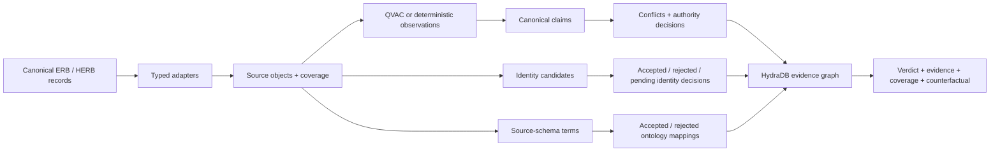

# SourceTruce

SourceTruce is an enterprise evidence court for Hack Hydra Track 01. It turns contradictory records into a claim-level ontology in HydraDB, records why identities and source fields do—or do not—align, and issues one of four verdicts: `SUPPORTED`, `DISPUTED`, `NOT_FOUND`, or `UNKNOWN`.

The one-click demo uses real [Enterprise RAG Bench](https://github.com/onyx-dot-app/EnterpriseRAG-Bench) and [Salesforce HERB](https://huggingface.co/datasets/Salesforce/HERB) records. Enterprise text stays local: QVAC is called through its official Vercel AI SDK provider on loopback. QVAC proposes grounded observations; deterministic policy and HydraDB paths decide the result.

## What makes it different

Conventional RAG retrieves passages and asks a model to reconcile them inside a prompt. SourceTruce makes the reconciliation inspectable graph data:

- multiple extraction observations consolidate into one semantic claim without duplicating the answer;
- losing claims remain queryable after conflict resolution;
- `owner` in Google Drive, HubSpot, and Fireflies maps through source context and domain/range constraints—not field-name similarity;
- names never auto-merge by fuzziness alone; verified identity conflicts are hard blockers;
- `NOT_FOUND` requires a completed coverage slice; missing coverage yields `UNKNOWN`;
- each verdict states what new evidence or decision would change it.

## Four live judge cases

| Case | Real-data proof | Result |
| --- | --- | --- |
| Resolve a conflict | ERB Jira proposal says 20%; applied Drive policy says 30% | `SUPPORTED` → 30%, with both exact quotes retained |
| Disambiguate “owner” | ERB Drive and HubSpot source-schema observations | `FILE_OWNER` and `OPPORTUNITY_OWNER`, not generic `OWNS` |
| Decide who this person is | HERB contains two David Taylor records with different employee IDs | Keep separate; the hard constraint blocks the fuzzy match |
| Admit uncertainty | HERB has no completed `favorite_lunch` coverage | `UNKNOWN`, not a fabricated answer or false `NOT_FOUND` |

Every successful case is assembled from live HydraDB queries. API failures return HTTP 503; there is no evidence-file or in-memory success fallback.

## Architecture



HydraDB stores the ontology and performs the decisive traversals. Removing it loses claim-to-observation provenance, competing claims, policy decisions, rejected mappings, identity blockers, and coverage boundaries. See [the ontology reference](docs/ontology.md).

## How to run the evidence court

### Requirements

- Node.js 20 or newer
- npm
- Docker with Compose
- Python 3 for canonical ERB acquisition
- local checkouts or acquired slices of HERB and ERB outside this repository

Install dependencies and start HydraDB:

```bash
npm install
cp .env.example .env.local
npm run hydra:up
```

Start QVAC in a second terminal. The server binds to `127.0.0.1:11436` and exposes the `sourcetruce-extractor` model through `@qvac/ai-sdk-provider` and AI SDK 7.

```bash
npm run qvac:doctor
npm run qvac:serve
```

Acquire the bounded canonical ERB conflict slice from Hugging Face. Evaluation labels select records during acquisition but are not emitted into runtime JSONL.

```bash
python3 -m venv .local/data-venv
.local/data-venv/bin/pip install -r requirements-data.txt
.local/data-venv/bin/python scripts/fetch_erb_evidence.py \
  --selection conflicts \
  --questions "$ERB_QUESTIONS" \
  --output "$ERB_CONFLICTS_JSONL" \
  --manifest "$ERB_CONFLICTS_MANIFEST"
```

Populate the verified graph lanes:

```bash
npm run hydra:smoke -- --input "$HERB_DIR" --evidence "$EVIDENCE_DIR/herb-structural.json"
npm run extract:erb-conflicts -- \
  --documents "$ERB_CONFLICTS_JSONL" \
  --questions "$ERB_QUESTIONS" \
  --output "$EVIDENCE_DIR/erb-conflicts.json" \
  --limit 20
npm run adjudicate:erb-conflict -- \
  --extractions "$EVIDENCE_DIR/erb-conflicts.json" \
  --output "$EVIDENCE_DIR/qst_0411.json"
npm run audit:herb-identities -- --input "$HERB_DIR" --output "$EVIDENCE_DIR/herb-identities.json"
```

The source-aware alignment command additionally requires an `alignment-discovery` acquisition manifest:

```bash
npm run discover:erb-alignment -- \
  --input "$ERB_ALIGNMENT_JSONL" \
  --manifest "$ERB_ALIGNMENT_MANIFEST" \
  --output "$EVIDENCE_DIR/erb-alignment.json"
```

Start the app and open [http://localhost:3000](http://localhost:3000):

```bash
npm run dev
```

## Configuration reference

| Variable | Default | Purpose |
| --- | --- | --- |
| `HYDRA_HTTP_URL` | `http://127.0.0.1:8443` | HydraDB HTTP endpoint |
| `HYDRA_TOKEN` | local development token | Bearer token; change before non-loopback use |
| `HYDRA_GRAPH_ID` | `default` | Graph identifier |
| `HYDRA_NAMESPACE` | `default` | Graph namespace |
| `HYDRA_CELL_ID` | `cell-0` | HydraDB cell |
| `QVAC_BASE_URL` | `http://127.0.0.1:11436/v1` | Local OpenAI-compatible QVAC endpoint |
| `QVAC_MODEL` | `sourcetruce-extractor` | QVAC registry alias |

HydraDB OSS 0.1.0 is pinned by image digest in `docker-compose.yml`. Compose binds HydraDB ports to loopback only.

## Verified results

Fresh local evidence from August 19, 2026:

| Lane | Result |
| --- | ---: |
| Live judge cases | 4 attempted / 4 completed / 100% expected outcome |
| ERB conflict extraction | 20 questions attempted; 26/40 observations accepted; 14 rejected |
| Fully promoted ERB conflict verdicts | 1 (`qst_0411`) |
| Source-aware mappings | 5 accepted + 5 rejected alternatives |
| HERB identity candidates | 1,645 same-name pairs |
| Hard negative identity pairs blocked | 1,627 |
| SourceTruce false merges on known hard negatives | 0 |
| Full HERB graph | 12,378 nodes / 22,906 edges |
| Unit tests | 123 passed + 2 integration-only tests skipped in the ordinary run |
| Explicit Hydra integration | 2/2 passed |

The 20-question conflict run is intentionally reported as an attempt, not a benchmark score. The 0.6B local model rejected 14 observations and several accepted observations are not yet strong enough for automated adjudication. Only `qst_0411`, where both exact quotes and lifecycle states validate, is promoted into the judge UI. This is a quality limitation, not hidden missing data.

Run the focused live evaluation:

```bash
npm run evaluate:first-prize -- \
  --herb-input "$HERB_DIR" \
  --output "$EVIDENCE_DIR/first-prize.json"
```

## How to verify the build

```bash
npm test
HYDRA_INTEGRATION=1 npm test -- src/hydra/hydra.integration.test.ts
npm run typecheck
npm run lint
npm run build
npm audit
git diff --check
```

## Data handling and attribution

Corpora, benchmark labels, local model files, saved evidence, and screenshots are deliberately excluded from this public repository.

- Enterprise RAG Bench is MIT-licensed.
- Salesforce HERB is CC BY-NC 4.0 and its dataset card states research-use limitations. SourceTruce does not imply unrestricted commercial use.
- HydraDB and QVAC retain their own licenses and terms.

See [ATTRIBUTION.md](ATTRIBUTION.md) for dependency and dataset links.

## License

SourceTruce is licensed under the [MIT License](LICENSE).
